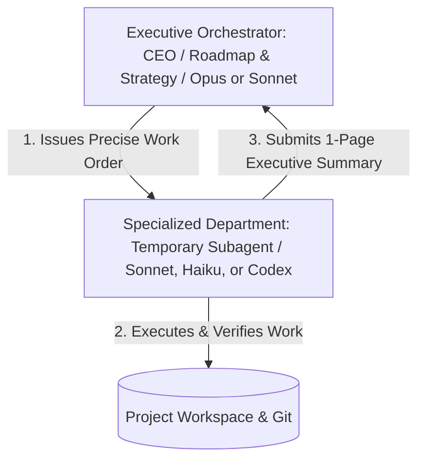

# superpowers-masterplan

> A Claude Code & Codex CLI plugin for multi-hour engineering work — featuring durable run bundles, a robust four-phase lifecycle, parallel wave dispatch, and asymmetric review.

Current release: **v6.3.3** · **License:** MIT · **Works with:** Claude Code, Codex CLI · See [CHANGELOG.md](./CHANGELOG.md)

---

## 1. Why Masterplan Matters (The Big Picture)

Multi-hour software engineering tasks are notoriously fragile for AI assistants. Traditional AI agents run entirely within the ephemeral chat history of a single session. This architectural limitation creates two critical failure modes:

*   **Session Loss & Plan Erasure (The Ephemerality Trap):** An accidental `/clear` command, an aggressive context compaction, an IDE crash, or a host terminal restart will immediately wipe your agent's active memory. The true loss in a multi-hour task isn't "the code I was about to write"—it's the **planning metadata**. Reconstructing which plan tasks were already completed, which active wave was in flight, which subagent dispatch was executing on which branch, and what decisions the operator approved at previous gates is practically impossible to recover from memory on a 6-hour task. Rebuilding this state manually forces you to effectively start over.
*   **The Context Degradation Loop:** As an inline session grows, it continuously accumulates stale code drafts, build logs, and past conversations. This clutter degrades model reasoning in two distinct ways:
    1.  *Reasoning & Attention Decay (Correctness):* Even on a 200k-token window, after a dozen tasks the orchestrator is reasoning against accumulated garbage context (stale experiments, partial diffs, and verbose terminal outputs). Attention degrades well before the token window is full, causing the model to quietly misroute tasks or repeat past mistakes.
    2.  *Compounding Cost (Token Efficiency):* Every single accumulated byte is rebilled on every single turn. A long inline run pays compound interest on thousands of tokens of context that should have been discarded hours ago, multiplying your API costs exponentially. 1M context windows seem attractive at first glance, but they're usually a trap that just makes you waste tokens.

    **The Solution: Subagent Context Isolation**
    To defeat this degradation loop, Masterplan completely isolates the context window of your main orchestrator session from raw file content and build logs. Instead of reading or editing files directly in your main chat, the orchestrator delegates all physical tasks—such as code modification, terminal execution, and testing—to short-lived, specialized subagents. These subagents operate in isolated, independent context windows and return only lightweight, structured digests (≤ 5KB) to the orchestrator. Stale code and massive logs are completely discarded, keeping the primary context window cheap, fast, and sharp.

---

## 2. Hierarchical Delegation (Corporate Department Analogy)

To enforce strict context isolation and keep execution fast, cheap, and precise, Masterplan operates like a well-structured corporation. **Senior leadership never rolls up their sleeves to do raw labor**—doing so would clutter their desks, overwhelm their cognitive bandwidth, and cause them to lose sight of the roadmap.

Instead, Masterplan structures its work through a highly disciplined hierarchy of specialized agents:



### Roles and Hierarchical Structure

*   **The Executive Orchestrator (CEO / Senior Leadership):** Manages the big-picture implementation plan, coordinates waves of tasks, manages high-level logic, and handles critical pivots or user prompts. The CEO remains high-altitude and never reads hundreds of lines of code or executes shell commands directly to keep their "desk" (context window) pristine.
*   **Specialized Departments (Subagents):** Short-lived, highly focused temporary workers spawned to execute a single, isolated assignment (e.g., a file refactoring, a dependency audit, or a test run). Once their specific task is done, the department is disbanded.

### Strict Desk Hygiene: The Work Order & Executive Summary

To keep the CEO's desk perfectly organized and free of distractions, the delegation follows a strict communication protocol:

1.  **The Work Order (Dispatch Brief):** The CEO hands the subagent a clear, non-negotiable set of instructions containing the precise **Goal**, the explicit **Inputs** it is allowed to read, the **Scope** of files it is permitted to modify, and strict **Budget/Autonomy Constraints**.
2.  **The Executive Summary (Digest):** When the subagent finishes, it does not dump all its intermediate drafts, scratchpads, and raw tool outputs onto the CEO's desk. Instead, it packages its results into a concise **Executive Summary (Digest ≤ 5KB)** detailing the key achievements, commit SHAs, and test outcomes. All raw intermediate noise is discarded, keeping the CEO's context window perfectly clean and ready for the next strategic decision.

### Model Routing: Right Tool, Right Cost
Masterplan automatically selects the optimal model for each step, keeping your API bill as small as possible:

| Phase / Task Class | Model | Why This Model Matters |
| :--- | :--- | :--- |
| **Discovery scans (Step I1)** | **Haiku** | Rapid, parallel, cheap mechanical extraction. |
| **Per-task implementation** | **Sonnet** | The primary coding workhorse via `superpowers:subagent-driven-development`. |
| **Conversion & rewriting** | **Sonnet** | Intelligent generation and file-rewriting. |
| **Architecture / Ambiguous specs** | **Opus** | Deep, complex reasoning and trade-off analysis. |
| **Small, single-file coding tasks** | **Codex** | Bounded, hyper-focused edits via `codex:codex-rescue`. |
| **Asymmetric Codex REVIEW** | **Codex** | Fresh-eyes review of Sonnet/Claude diffs against spec (when `codex_review: on`). |
| **Completion inference** | **Haiku** | Fast, parallel classification of task state. |

---

## 3. Durable Run Bundles & Executive Function (The Masterplan Solution)

`superpowers-masterplan` externalizes session state into a structured **Run Bundle** (`docs/masterplan/<slug>/`) stored directly on your disk. The filesystem—not your chat context—is the single source of truth. 

Each bundle contains:
*   `state.yml` (the durable pointer representing active phase, worktree, branch, autonomy level, current task, pending gates, and background action states)
*   `spec.md` (the product design specification, grounding intent and scope boundaries)
*   `plan.md` (the step-by-step task checklist and routing annotations)
*   `events.jsonl` (the append-only operational events log logging commits, decisions, and subagent completions)
*   `retro.md` (the development retrospective compiled at the end of the run)

If your session crashes, compacts, or gets cleared, **your progress is perfectly safe**. Simply run `/masterplan` (no arguments) to scan active bundles and pick up exactly where the event log left off. You can swap models, change hosts, or transition seamlessly from Claude Code to the Codex CLI mid-run.

### Executive Function & Planning

Every dispatch, parallel wave execution, and high-level decision is managed and tracked directly by the run bundle. Instead of relying on volatile chat history, this on-disk state acts as the orchestrator's **executive function and planning layer**, systematically driving tasks and maintaining strict architectural focus across hours of execution.

At the core of this layer is `events.jsonl`, an append-only event stream recording every operational step. This provides a detailed audit trail of the run's history, allowing the system to reconstruct context and resume losslessly at any moment.

### Visualizing a Wave Dispatch
When fanning out three parallel Codex subagents in a wave, Masterplan collapses what would be a 90K token chat transcript into just five lines of JSONL:

```jsonl
{"ts":"2026-05-16T16:01:00Z","event":"wave_routing_summary","wave":1,"members_by_route":{"codex":3,"inline_review":0,"inline_no_review":0},"members":["T1","T2","T3"]}
{"ts":"2026-05-16T16:10:00Z","event":"wave_task_completed","wave":1,"task":"T1","commit":"80b96d5","dispatched_by":"codex"}
{"ts":"2026-05-16T16:10:00Z","event":"wave_task_completed","wave":1,"task":"T2","commit":"0e0ce06","dispatched_by":"codex"}
{"ts":"2026-05-16T16:10:00Z","event":"wave_task_completed","wave":1,"task":"T3","commit":"322dac8","dispatched_by":"codex"}
{"ts":"2026-05-16T16:10:00Z","event":"wave_complete","wave":1,"members":["T1","T2","T3"],"commits":["80b96d5","0e0ce06","322dac8"]}
```

This structure makes `/clear` commands or proactive session restarts (`ScheduleWakeup` every ~3 completed tasks) completely lossless. Mid-session context is disposable, and the active state lives safely on disk.

---

## 4. The Three Architectural Pillars

To support multi-hour engineering runs with maximum reliability and efficiency, Masterplan is engineered around three core principles:

1.  **Auditability:** Every dispatch, branch transition, parallel wave execution, and model routing decision is appended instantly to `events.jsonl` with strict timestamps, commit hashes, and model configurations. You always have a clear, auditable trail of exactly what the AI decided and executed.
2.  **Workflow Parallelism:** Masterplan can group independent, parallelizable tasks together using parallel-group annotations. Rather than executing these tasks sequentially over N turns, the orchestrator fans them out simultaneously to multiple independent subagents in a single turn, cutting execution times dramatically.
3.  **Asymmetric Trust & Review:** The model that generates the code should not also grade it. Under this principle, Codex-produced edits skip Codex review—reducing redundant double-billing—and rely on strict automated test validation instead. Sonnet-produced edits undergo a full, fresh-eyes review by Codex before committing. This enforces rigid audit coverage without losing cost-efficiency.

---

## 5. Install

### Claude Code
Run the following commands inside the Claude Code CLI:
```text
/plugin marketplace add rasatpetabit/superpowers-masterplan
/plugin install superpowers-masterplan@rasatpetabit-superpowers-masterplan
/reload-plugins
```
> [!NOTE]
> The marketplace commands register the catalog and install the `masterplan-detect` skill. The upstream `superpowers` core plugin is declared as a dependency and will be automatically resolved. See [docs/install.md](docs/install.md) for offline, desktop-app, or manual installation paths.

### Codex CLI
Run the following command in your shell:
```sh
codex plugin marketplace add rasatpetabit/superpowers-masterplan
```
*Codex hosts the orchestrator under `/superpowers-masterplan:masterplan`. See [parts/codex-host.md](parts/codex-host.md) for Codex-specific suppression and behavior overrides.*

### Optional Telemetry Hook
To enable `/masterplan stats` and roll-up metrics, copy the hook into your global hooks directory and wire it as a Stop hook in `~/.claude/settings.json`:

```bash
mkdir -p ~/.claude/hooks
cp hooks/masterplan-telemetry.sh ~/.claude/hooks/
chmod +x ~/.claude/hooks/masterplan-telemetry.sh
```

```json
{
  "hooks": {
    "Stop": [
      {
        "hooks": [
          {
            "type": "command",
            "command": "bash \"$HOME/.claude/hooks/masterplan-telemetry.sh\"",
            "timeout": 3,
            "async": true
          }
        ]
      }
    ]
  }
}
```

*For signal definitions and opt-out specifications, see [docs/design/telemetry-signals.md](docs/design/telemetry-signals.md). For the full install reference (Claude Desktop, manual filesystem install, Codex CLI), see [docs/install.md](docs/install.md).*

---

## 6. Core Concepts Glossary

*   **Run Bundle:** The on-disk folder (`docs/masterplan/<slug>/`) holding a run's state files: `state.yml`, `spec.md`, `plan.md`, `plan.index.json`, `events.jsonl`, `retro.md`, `.lock`, and `eligibility-cache.json`. This is the portable database of your project run. *(See [parts/contracts/run-bundle.md](./parts/contracts/run-bundle.md))*
*   **Phase + Gate:** The lifecycle stages of a run: **B0–B1 (brainstorm), B2–B3 (plan), C1–C6 (execute), R (retro)**. Gates are automated validators at phase boundaries. Under strict autonomy levels, gates will pause for user approval; in loose/full modes, they auto-advance when conditions are satisfied. *(See [docs/internals.md](./docs/internals.md))*
*   **Wave:** A group of independent tasks annotated with matching `**parallel-group:**` values, dispatched and processed simultaneously in one assistant turn. *(See [parts/contracts/agent-dispatch.md](./parts/contracts/agent-dispatch.md))*
*   **Autonomy Levels:** Configures the interaction model (`gated` | `loose` | `full`). In `gated` mode (default), the orchestrator prompts you before crossing any phase gate. In `loose`, it auto-advances through successful gates. In `full`, it suppresses even mid-task confirmation prompts. *(See [docs/config-schema.md](./docs/config-schema.md))*
*   **Subagent Dispatch Contract:** A strict validation scheme. Every dispatch site must declare a `contract_id` and match a registered contract in `commands/masterplan-contracts.md`. Subagent outputs are structurally validated; any return violations trigger a `contract_violation` event. The `--brief-style` doctor check enforces that no orphan dispatch sites exist. *(See [parts/contracts/agent-dispatch.md](./parts/contracts/agent-dispatch.md))*
*   **Asymmetric Review:** Skips Codex review on Codex-produced edits (emitting `review→SKIP(codex-produced)` with `decision_source: codex-produced`). This prevents a model from grading its own homework. Codex-produced work is checked via automated tests, while Sonnet-produced changes undergo a full Codex review. *(See [docs/internals.md](./docs/internals.md))*
*   **Guard C (flock):** A concurrency lock (`.lock` file with a 5-second write timeout managed via `bin/masterplan-state.sh`). This prevents concurrent workflows or multi-agent worktrees from corrupting `state.yml` or `events.jsonl`. Doctor check #42 warns when `.lock` is older than 1 hour. *(See [parts/step-c-verification.md](./parts/step-c-verification.md))*

---

## 7. CLI Command Reference (Verbs)

Masterplan groups its command verbs by their lifecycle phase for easy discovery. Unrecognized arguments automatically route to the active resume picker.

### Discovery & Intake
*   `/masterplan`
    *   **Phase:** Intake
    *   **What it does:** Displays the interactive resume picker or guides you through a new topic setup.
*   `/masterplan import [--pr=|--issue=|--file=|--branch=]`
    *   **Phase:** Intake
    *   **What it does:** Converts legacy planning files and registers them into a new run bundle (`state.yml`).
*   `/masterplan next`
    *   **Phase:** Intake
    *   **What it does:** Automatically routes you to the next actionable in-progress plan.

### Spec & Plan
*   `/masterplan brainstorm <topic>`
    *   **Phase:** Brainstorm
    *   **What it does:** Runs codebase discovery scans and compiles a robust design specification (`spec.md`). Halts at B1 gate.
*   `/masterplan plan [<topic>|--from-spec=]`
    *   **Phase:** Plan
    *   **What it does:** Generates the task list and implementation strategy (`plan.md`). Halts at B3 gate.
*   `/masterplan full <topic>`
    *   **Phase:** All Phases
    *   **What it does:** Executes the complete pipeline end-to-end: Brainstorm → Plan → Execute.

### Execution & Retrospective
*   `/masterplan execute [<topic>|<state>]`
    *   **Phase:** Execution
    *   **What it does:** Resumes or initiates the task-by-task execution loop. Appends progress to `events.jsonl`.
*   `/masterplan retro [<state>]`
    *   **Phase:** Retrospective
    *   **What it does:** Analyzes the run history, generates a development retrospective (`retro.md`), and archives the bundle.

### Diagnostics & Maintenance
*   `/masterplan doctor [--fix]`
    *   **Phase:** Diagnostics
    *   **What it does:** Runs 47 proactive lint checks across all plan bundles to catch state drift. `--fix` resolves repairable issues.
*   `/masterplan status`
    *   **Phase:** Diagnostics
    *   **What it does:** Prints a visual summary of the active plan, current phase, and recent activities.
*   `/masterplan stats`
    *   **Phase:** Diagnostics
    *   **What it does:** Generates token usage, run-times, and per-subagent telemetry reports.
*   `/masterplan validate`
    *   **Phase:** Diagnostics
    *   **What it does:** Performs schema-validity checks on your `.masterplan.yaml` configurations and `state.yml` bundles.
*   `/masterplan clean`
    *   **Phase:** Diagnostics
    *   **What it does:** Prunes old artifacts and cleans up completed/archived bundles into the `archive/` folder.

*For detailed flags and CLI arguments, see [docs/verbs.md](docs/verbs.md). For custom doctor rules, see [parts/doctor.md](parts/doctor.md).*

---

## 8. The Performance & Cost Engine

Masterplan coordinates three high-powered mechanisms to keep 6-hour runs exceptionally cheap and fast:

1.  **Wave Parallelism (v2.0.0+):** Groups independent, read-only tasks using the `**parallel-group:**` annotation. Rather than performing N sequential turns, Masterplan dispatches N subagents in parallel under a single assistant turn. High-level orchestrator context costs remain fixed as a sum of small digests (commit SHA, verify result, ≤5120-byte note) × wave width rather than full transcripts. The largest shipped run was a 4-member parallel batch (`codex-routing-fix` wave 4: T9–T12 in commit `c94b5cb`).
2.  **Aggressive Codex Routing (v5.8.0+):** The plan generator defaults to `**Codex:** ok` for single-file edits with clear verification tests. It reserves Sonnet for complex multi-file changes or ambiguity, dramatically reducing API fees compared to the prior conservative default (which left a majority of Codex-eligible tasks routing to Claude SDD).
3.  **Asymmetric Review (v5.8.0+):** Codex-generated code skips Codex review (emitting `review→SKIP(codex-produced)` with `decision_source: codex-produced`) to avoid redundant double-billing. Codex edits rely on test validation, while Sonnet work gets full Codex review. Doctor check #43 (`codex_review_coverage`) verifies 100% review coverage (either `review→CODEX` or `review→SKIP`) across all tasks.

---

## 9. Proactive Safety: Doctor & Failure Classes

Autonomous runs are vulnerable to state drift and silent errors. Masterplan embeds a robust safety net:

*   **Proactive Doctor Checks:** `/masterplan doctor` runs 48 structural audits. It is complexity-aware: simple `low` plans skip ~14 ledger and telemetry checks to reduce noise, while `high` plans add strict audits (e.g., check #22 for rigor evidence, check #40 for parallel-group annotation coverage). Check #43 validates wave review events. `--fix` repairs common issues.
*   **Versioned Failure Classes:** Runtime anomalies are mapped instantly to a strict taxonomy in [parts/failure-classes.md](parts/failure-classes.md). Mapped classes (e.g., `wave_codex_review_skip` when wave review coverage drops, `subagent_return_oversized` when output > 5120 bytes, `eligibility_cache_event_missing` when cache events are absent, or `dispatch_brief_unregistered` when site contracts are unregistered) enable the orchestrator to recover gracefully or halt safely.
*   **Self-Host Audits:** For developers, `bin/masterplan-self-host-audit.sh` validates the orchestrator against its own contracts, enforcing Pattern D (contracts must be declared within 30 lines of every lifecycle `DISPATCH-SITE` call) and CD-9 compliance.

---

## 10. Configuration

Configuration is loaded hierarchically:
`~/.masterplan.yaml` *(User level)* → `<repo-root>/.masterplan.yaml` *(Repo level)* → CLI flags → `state.yml` *(Run level)*.

```yaml
autonomy: gated              # gated | loose | full
complexity: medium           # low | medium | high
runs_path: docs/masterplan
parallelism:
  enabled: true              # wave dispatch on; set false to force serial
codex:
  routing: auto              # auto | on | off (auto respects plan annotations)
  review: on                 # on | off (toggle Codex reviews of Sonnet code)
  detection_mode: scan-then-ping   # scan-then-ping | trust | ping
  unavailable_policy: degrade-loudly   # degrade-loudly | block
```

### Key Configurations Explained

> [!TIP]
> **Autonomy Levels:**
> *   `gated` *(Recommended for new users)*: The orchestrator halts and asks for your review at every major milestone and phase boundary.
> *   `loose` *(Recommended for experienced users)*: Automatically advances past successful phase gates. Perfect for hands-free multi-hour operations.
> *   `full` *(For autonomous loops)*: Suppresses all interactive prompts. Ideal when executing pipelines inside scripts or loops.

*   **Codex Detection:** `scan-then-ping` (default) avoids slow connection handshakes by doing a cheap scan first and pinging only on a miss. On locked-down corporate networks where pings fail, set `detection_mode: trust`.
*   **Codex Unavailable Policy:** `degrade-loudly` degrades gracefully by switching tasks to Claude-only execution but registers telemetry alerts and doctor warnings.

---

## 11. Troubleshooting

**Q: My session was cleared or crashed mid-run. How do I resume?**
*   **A:** Run `/masterplan` with no arguments. The picker scans your active bundles and resumes perfectly using on-disk `state.yml` and `events.jsonl` files.

**Q: Can I run multiple plans concurrently?**
*   **A:** Yes, in separate worktrees. Guard C (`flock` on `.lock` files via `bin/masterplan-state.sh` with a 5-second timeout) queues writes gracefully to avoid log corruption.

**Q: The doctor WARNs on check #43 for older bundles.**
*   **A:** Expected. `codex_review_coverage` (v5.8.0) warns on bundles predating wave reviews. No auto-fix exists; ignore or accept the warning.

**Q: Codex is not being detected.**
*   **A:** If firewalls block pings, set `detection_mode: trust` in your user-level configuration file `~/.masterplan.yaml`.

**Q: `/masterplan stats` shows duplicated `parent_turn` counts.**
*   **A:** Resolved in the patch release immediately before v5.8.0. Upgrade your install or deduplicate pre-patch logs in `subagents.jsonl` by `ts+session_id` when querying historical metrics.

---

## 12. Links & Reference

*   **Design & Architecture:** [docs/internals.md](./docs/internals.md)
*   **Contracts & Rules:** [commands/masterplan-contracts.md](./commands/masterplan-contracts.md) · [parts/contracts/run-bundle.md](./parts/contracts/run-bundle.md) · [parts/contracts/cd-rules.md](./parts/contracts/cd-rules.md)
*   **CLI & Configuration Reference:** [docs/verbs.md](./docs/verbs.md) · [docs/config-schema.md](./docs/config-schema.md)
*   **Safety & Diagnostics:** [parts/doctor.md](./parts/doctor.md) · [parts/failure-classes.md](./parts/failure-classes.md)
*   **AI Developer Guidelines:** Start session with [CLAUDE.md](./CLAUDE.md) for canonical order, anti-patterns, and core operating principles.
